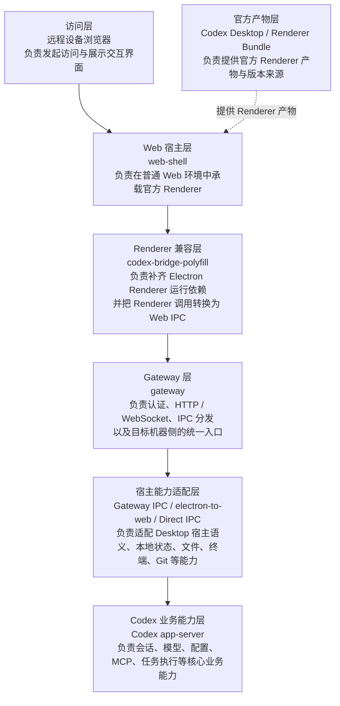

# OpenCodex

OpenCodex 是一个 Codex 运行环境的轻量实现，通过它能把官方 Codex Renderer 运行在普通 Web 环境中，使用户可以通过任意设备、任意网络，远程访问并操作目标机器上运行的 Codex。

一句话概括：

```text
browser -> web-shell -> official Codex renderer -> bridge polyfill -> gateway -> Codex app-server / local host capabilities
```

---
天塌了😭刚准备开源，谁知道一觉醒来ChatGPT App就对Codex做了支持

但对比官方还是有优势的：
1. 无需魔法上网
2. 无需Google Play账号
3. Codex完整功能支持，例如文件树、终端、审查等，便于随时随地AI Coding。


> 目前本软件仅为测试版，可能还存在不少问题，如若发现可issue反馈至开发者修复。

<p align="center">
  
  &nbsp;
  
  &nbsp;
  
  &nbsp;
  
</p>

## 核心内容

本项目包含三部分核心内容：

| 模块 | 作用 |
| --- | --- |
| `web-shell/` | 浏览器入口，用于加载官方 renderer 和搭建Render运行环境。 |
| `gateway/` | 本地 Node gateway，提供 HTTP、WebSocket、IPC 兼容、本地文件、git、终端、状态同步和 app-server 转发。 |
| `/electron-to-web/` | Electron 语义适配层，gateway 默认优先使用它来复用 Electron IPC 行为，另有自实现的DirectGatewayElectronIpcPort。 |

本软件**不会修改**Codex的代码，仅使用对应Render产物。

Gateway启动时会自动检查本地Codex是否有更新，有更新时会自动更新使用的Render产物（也就是会自动更新到对应Codex版本）

## 架构概览



关键原则：

- 复用官方 Renderer，不重写主界面。
- 浏览器侧只补宿主环境，不承接业务语义。
- gateway 负责本地能力和 app-server 代理，避免远端浏览器直接接触本机 token 或 app-server。
- 未覆盖的 Desktop IPC 通过 `reports/unknown-ipc.jsonl` 持续记录并补齐。

## 环境要求

- Node.js 20 或更高版本
- npm
- 本机已安装 Codex Desktop（推荐），或通过环境变量显式指定 Codex Desktop / official bundle 路径。
- Mac/Windows系统，目前Mac完全支持，Windows未测试。

依赖安装：

注意要子模块取
```
git clone --recursive xxx
```

```bash
npm install
```

## 如何使用

先编译

```bash
npm run build:vendor
```
```bash
npm run build:gateway
```

启动服务：

```bash
HOST=0.0.0.0 PORT=3737 CODEX_WEB_PASSWORD=你的密码 npm run web:dev
```

健康检查：

```text
curl http://127.0.0.1:3737/api/health
```

远端访问：

配合Tailscale、ZeroTier、企业自建VPN等实现**远程局域网**安全访问，**不建议直接暴露公网**。


## 常用环境变量

| 变量 | 默认值 | 说明 |
| --- | --- | --- |
| `HOST` | `0.0.0.0` | gateway 监听地址，默认面向远程访问。 |
| `PORT` | `3737` | gateway 监听端口。 |
| `CODEX_WEB_PASSWORD` | 空 | **强烈建议设置；设置后会启用 gateway 访问密码，否则远程访问时安全无法保证。** |
| `CODEX_WEB_AUTH_TOKEN_TTL_MS` | `43200000` | gateway 访问 token 有效期，默认 12 小时。 |
| `CODEX_WEB_DEBUG` | 空 | 设为 `1` 或 `true` 后输出更多调试日志。 |
| `CODEX_WEB_SLOW_LOG_MS` | `750` | IPC 慢调用日志阈值。 |
| `CODEX_WEB_LOCAL_FILE_TOKEN_TTL_MS` | `300000` | 本地文件预览 URL token 有效期。 |
| `CODEX_DESKTOP_APP_PATH` | 自动扫描 | 指定 Codex Desktop 安装路径或 `app.asar` 所在路径。 |
| `CODEX_WEB_OFFICIAL_BUNDLE_DIR` | `cache/official-bundle` | 指定官方 webview 解包缓存目录。 |
| `CODEX_WEB_IPC_IMPL` | `electron-to-web` | 设为 `direct` 可使用 direct IPC 兜底实现。 |


## 文件/目录说明

| 路径 | 说明 |
| --- | --- |
| `gateway/src/server.ts` | gateway 启动入口，组装 HTTP、WebSocket、认证、official bundle、IPC 和 app-server。 |
| `gateway/src/codex-app-server.ts` | Codex app-server 客户端，负责连接、请求转发、缓存预热和健康状态。 |
| `gateway/src/ipc/` | gateway IPC 抽象和 Electron/Codex 兼容实现。 |
| `gateway/src/official/` | Codex Desktop app.asar 扫描、识别、缓存和 webview 解包逻辑。 |
| `web-shell/index.html` | 浏览器 bootstrap shell，负责登录页、设置入口和加载 patched official renderer。 |
| `web-shell/codex-bridge-polyfill.js` | 浏览器侧 Electron/Codex bridge polyfill。 |
| `reports/unknown-ipc.jsonl` | 运行时记录的未知 IPC。 |

## npm 脚本

| 脚本 | 说明 |
| --- | --- |
| `npm run build:gateway` | 编译 `gateway/src` 到 `gateway/dist`。 |
| `npm run web:dev` | 启动已编译的 gateway。 |
| `npm run build:vendor` | 编译 `vendor/electron-to-web`。 |
| `npm run test:vendor` | 运行 `vendor/electron-to-web` 测试。 |

## 排障

### 打开会话历史聊天空

第一次加载较慢，且受到远程局域网速率限制，一般看不到记录等一会就好。

### 启动后打不开页面

先确认 gateway 是否监听成功：

```bash
curl http://127.0.0.1:3737/api/health
```

如果端口冲突，换端口启动：

```bash
PORT=3738 npm run web:dev
```

### 找不到 Codex Desktop official bundle

显式指定本机 Codex Desktop 路径：

```bash
CODEX_DESKTOP_APP_PATH="/Applications/Codex.app" npm run web:dev
```

也可以指定缓存目录：

```bash
CODEX_WEB_OFFICIAL_BUNDLE_DIR="./cache/official-bundle" npm run web:dev
```

### IPC 行为不完整

查看未知 IPC 记录然后报告给开发者：

```bash
tail -f reports/unknown-ipc.jsonl
```

### 友链

[LinuxDo](https://linux.do/)